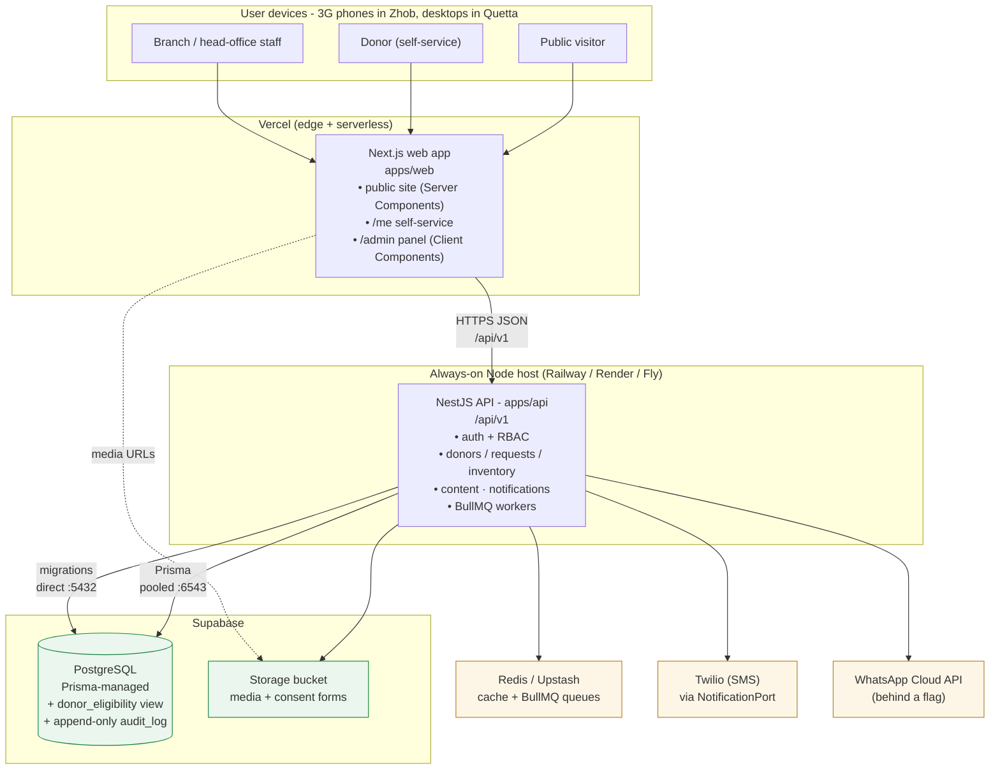
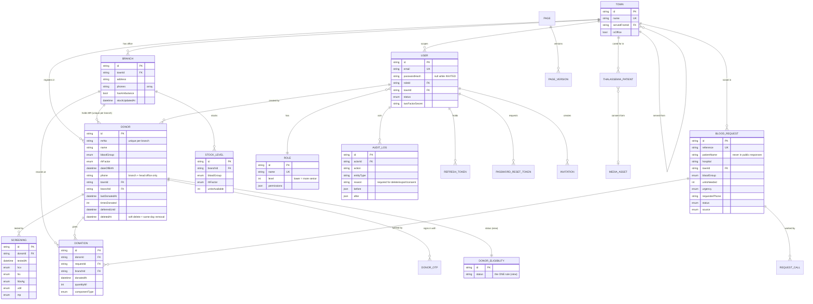
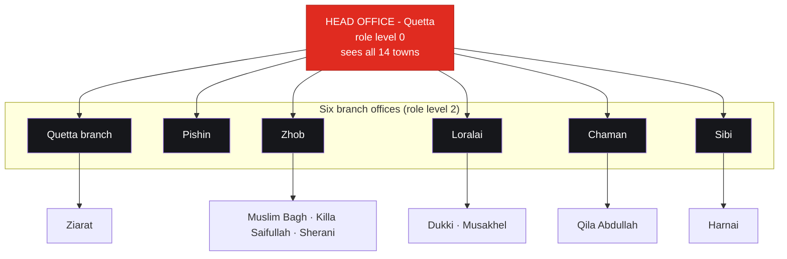
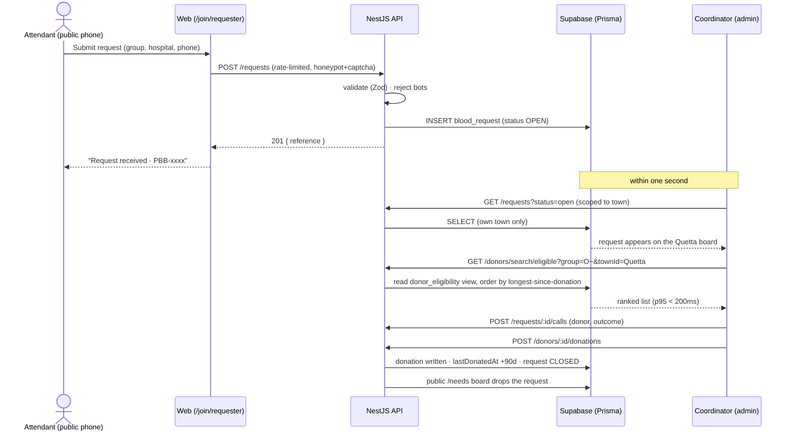
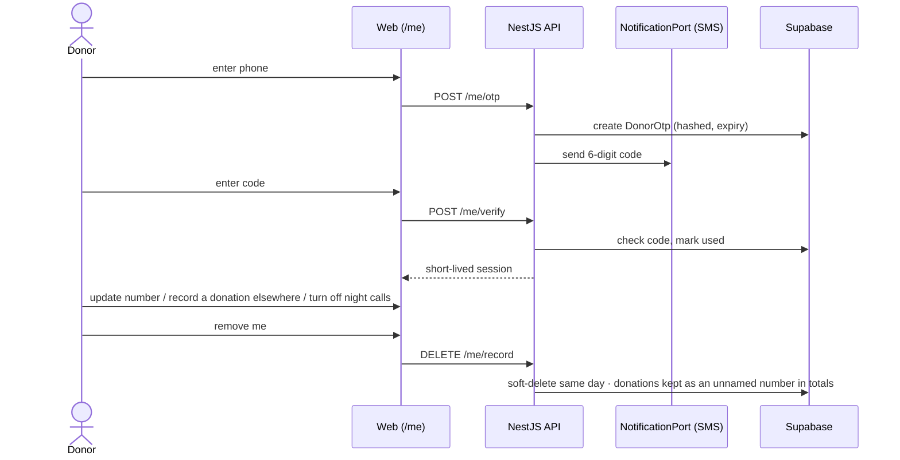
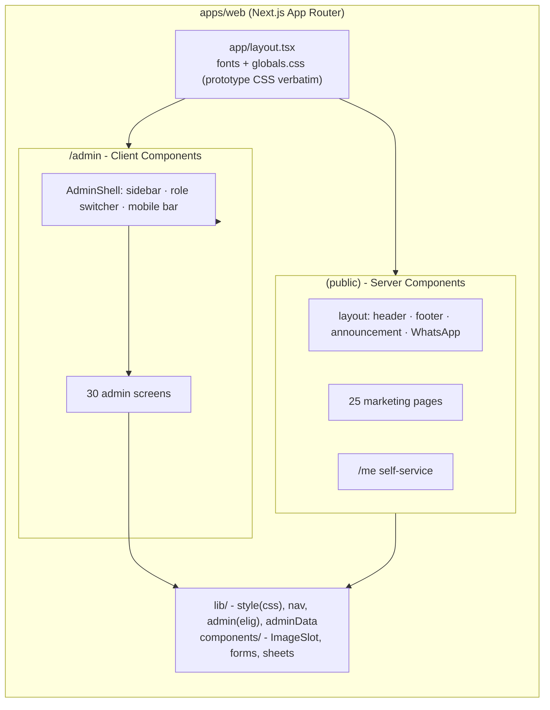

# PBB Platform - Architecture & Design

This is the single reference for how the Pashtoonkhwa Blood Bank platform is put together:
the topology, the data model (ERD), the request flows, how the head office and branches
interact, and how it is deployed. Diagrams are Mermaid (they render on GitHub, Vercel, and
most Markdown viewers).

- **What & why:** [`PBB Build Harness.md`](<PBB Build Harness.md>)
- **Build plan / tracks:** [`BUILD-PLAN.md`](BUILD-PLAN.md)
- **Deployment specifics:** [`DEPLOYMENT.md`](DEPLOYMENT.md)
- **Screens:** [`ROUTE-INVENTORY.md`](ROUTE-INVENTORY.md)

---

## 1. System topology



**Boundaries that matter:**

- The **web never talks to Postgres directly.** Every read/write goes through the API, which
  is where scoping (role + town) and the ethical constraints are enforced. The browser can be
  inspected; the server cannot be bypassed (INV-10).
- **Prisma is the only path to the database.** The pooled connection (`:6543`,
  `pgbouncer=true`) is used at runtime; the direct connection (`:5432`) is used for migrations.
- **Providers sit behind ports.** SMS/WhatsApp go through `NotificationPort`; media through
  `StoragePort`. Swapping Twilio, or moving media to Cloudinary, changes one file.

---

## 2. Deployment architecture

| Concern | Local dev | Production |
|---|---|---|
| Web | `next dev` :3000 | **Vercel** (root dir `apps/web`) |
| API | `nest start` :4000 | Always-on Node host + BullMQ workers |
| Postgres | Docker `:5433` | **Supabase** (pooled `:6543` runtime, direct `:5432` migrations) |
| Redis | Docker `:6379` | Upstash (serverless, Vercel-friendly) |
| Media | local filesystem | **Supabase Storage** (`StoragePort`; Cloudinary later if needed) |
| SMS / WhatsApp | `console` driver (logs) | Twilio + WhatsApp Cloud API (flagged) |

**Domain:** none yet. Until one is bought, the app runs on the default **`*.vercel.app`** URL
for the web and the host's URL for the API - set `NEXT_PUBLIC_API_URL` and `CORS_ORIGINS`
accordingly. When a domain is added, only those two env values (plus Vercel's domain setting)
change; nothing in the code is domain-coupled.

**Why Vercel for web but a separate host for the API:** the API runs background workers
(nightly backups, screening-expiry sweeps, SMS/WhatsApp queues) that need a persistent
process, which Vercel's serverless model does not provide. The web is a perfect fit for
Vercel. See [`DEPLOYMENT.md`](DEPLOYMENT.md) for the alternative (API-on-Vercel + Supabase
cron) if you prefer a single provider.

---

## 3. Data model (ERD)

Derived from the branch Donor Diary and the prototype. Every field earns its place. The full
definition is `apps/api/prisma/schema.prisma`; this is the shape and the relationships.



### The rule that lives in the database

Callability is decided by **one** database view, `donor_eligibility` - never by application
arithmetic in more than one place (INV-5). It returns exactly one of seven states:

```
REMOVED · DEFERRED · NEVER_SCREENED · REACTIVE · SCREENING_STALE · COOLDOWN · ELIGIBLE
```

Every list, search, count and dashboard figure reads it, so two screens can never disagree.
The thresholds (90-day cooldown, 180-day screening staleness) exist only in migration `002`.

---

## 4. How the head office and branches interact

PBB is one head office in Quetta, six branch offices, and fourteen towns (eight served
without an office of their own).



**The scoping model (enforced server-side):**

- A **branch manager** or **data-entry clerk** sees and edits **only their own town's** donors,
  requests and stock. A branch manager cannot see another branch's stock as their own
  (INV-2).
- **Head office** sees the whole picture across all fourteen towns, and is the only role that
  can create accounts across towns or grant senior roles.
- A **town served without an office** (e.g. Sherani) is operated from its serving branch
  (Zhob). Its donors are counted from the register itself, so a donor can never sit in a town
  no filter can reach (INV-3).
- **Account creation is constrained:** a creator can never grant a role at or above their own
  `level`, nor place a user outside their own town. There is no self-registration - an account
  is created by somebody above it, receives an invitation link, and sets its own password
  (the head office never sees it).

**A branch that goes quiet:** if a branch stops updating stock, after 48 hours the public
shortage strip hides itself rather than show stale figures, and the branch turns red on the
head office's network screen.

---

## 5. Request flows

### 5.1 The emergency - the whole product

An attendant needs O− in Quetta at 02:00.



### 5.2 Staff sign-in + RBAC scoping

```mermaid
sequenceDiagram
    actor U as Staff
    participant W as Web (/admin/login)
    participant API as NestJS API
    participant DB as Supabase

    U->>W: email + password
    W->>API: POST /auth/sign-in
    API->>DB: find user, verify argon2id hash
    alt two-factor enabled
        API-->>W: 2FA required
        U->>API: POST /auth/two-factor/verify (TOTP)
    end
    API-->>W: access JWT (role + townId) + refresh token
    Note over W,API: every later request carries the JWT;<br/>the server derives scope from it - never the client
    U->>API: GET /donors (JWT)
    API->>API: guard: role permits? scope = own town
    API->>DB: SELECT donors WHERE town = caller's town
    DB-->>U: only permitted rows (INV-10, INV-11)
```

### 5.3 Donor self-service (phone + OTP)



---

## 6. Web application structure



- **Public site** = Server Components - fast on 3G, indexable.
- **Admin** = Client Components behind `AdminShell`; every figure is meant to come from one
  API field, never derived on the client (INV-1).
- **Shared vocabulary:** `lib/style.ts` (`css()` ports the prototype's inline styles),
  `lib/nav.ts` (the one town list), `lib/admin.ts` (the eligibility mirror - deleted once
  wired to the API).

---

## 7. Cross-cutting rules (the invariants)

The §7 invariants are enforced by `scripts/invariants/run.mjs` and the test suites:

| Rule | Guarantee |
|---|---|
| INV-1 | One source per number - no figure computed in two places |
| INV-2 | Scoped header ⇒ scoped body |
| INV-3 | No orphan records - every FK resolves |
| INV-5 | One eligibility rule - only `donor_eligibility` decides callability |
| INV-7 | Failures are visible - no catch leaves stale UI |
| INV-8 | Plurals + empty states at 0 / 1 / many |
| INV-9 | No dead controls - every button does something or is not rendered |
| INV-10 | Permissions are server-side |
| INV-11 | Privacy holds - phones/patient names never leak |
| INV-12 | The audit log is complete and immutable (append-only, DB-enforced) |

---

## 8. Current state vs target

- **Built & verified:** the schema + migrations + eligibility view + audit guard on Supabase;
  the full web UI (62 routes) as design (sample data); the NestJS API scaffold with a live
  `/health` DB round-trip.
- **Next:** wire the web to the API (auth, donor reads, request intake), which retires the
  web's sample-data eligibility mirror and turns the admin figures into real API fields.
